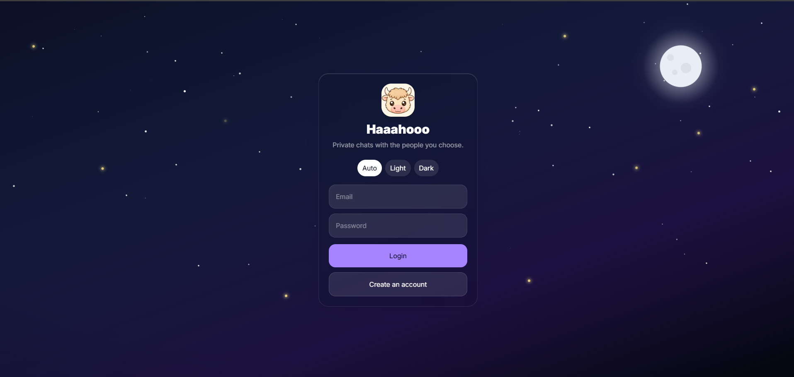
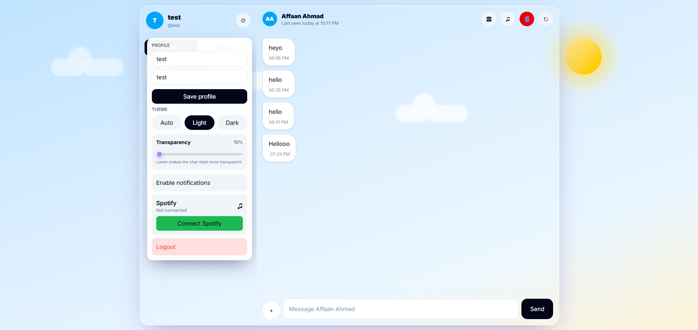
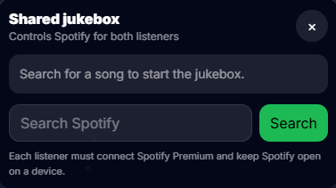

# Haaahooo

> Private messaging with friends — a cozy, real-time chat PWA for two.

Haaahooo is a personal, invite-only messaging app built around a single shared space between friends. Beyond text it bundles the things you actually do together: listen to music, watch videos in sync, hop on a call, and share moments — all wrapped in an animated sky that shifts with the time of day.



---

## Features

- **Real-time 1:1 messaging** — instant delivery over Supabase Realtime, with read receipts and typing feedback.
- **Voice notes & media** — record voice messages and share images/files inline.
- **Voice calls** — peer-to-peer in-browser calling.
- **🎵 Spotify Jukebox** — a shared music queue you both control; playback stays in sync across devices.
- **🎬 Watch Party (Cinema mode)** — queue YouTube videos and watch them together, frame-synced through a shared clock.
- **🤖 @swiggy** — mention `@swiggy` in a chat to summon an AI assistant (powered by Gemini) right inside the conversation.
- **🌤️ Living sky background** — a moon with twinkling stars, drifting fireflies and shooting stars at night; sun, rays and clouds by day; warm dawn/dusk glows in between. Optional rain/snow. Honors "reduce motion".
- **🔔 Push notifications** — Web Push (VAPID) so you never miss a message, even when the app is closed.
- **📱 Installable PWA** — add to home screen, works offline-aware, standalone full-screen.
- **✨ Glass UI** — soft-glass panels, adjustable chat transparency, and light / dark / auto (by time of day) themes.

## Screenshots

**Chat + settings** — day theme with a drifting-cloud sky, live settings panel (profile, theme, transparency, Spotify).



**Watch Party (Cinema mode)** — watch YouTube together in sync, with a chat overlay right on the video.


**Shared Jukebox** — search Spotify and control playback for both listeners.

<p align="center">
  
</p>

## Tech stack

| Area | Choice |
| --- | --- |
| Framework | [Next.js](https://nextjs.org) 16 (App Router) |
| UI | React 19, Tailwind CSS v4, [Motion](https://motion.dev) (Framer Motion) |
| Backend & data | [Supabase](https://supabase.com) (Postgres, Auth, Realtime, Storage) |
| Notifications | Web Push (`web-push`, VAPID) |
| Integrations | Spotify Web API, YouTube Data API, Google Gemini |
| Hosting | Vercel |

## Getting started

### Prerequisites

- Node.js 18+ and npm
- A [Supabase](https://supabase.com) project
- API credentials for the integrations you want (Spotify, YouTube, Gemini) and a VAPID key pair for push

### 1. Install

```bash
npm install
```

### 2. Configure environment

Create a `.env.local` in the project root:

```bash
# Supabase
NEXT_PUBLIC_SUPABASE_URL=your-project-url
NEXT_PUBLIC_SUPABASE_ANON_KEY=your-anon-key
SUPABASE_SERVICE_ROLE_KEY=your-service-role-key

# Web Push (VAPID)
NEXT_PUBLIC_VAPID_PUBLIC_KEY=your-vapid-public-key
VAPID_PRIVATE_KEY=your-vapid-private-key
VAPID_SUBJECT=mailto:you@example.com

# @swiggy assistant
GEMINI_API_KEY=your-gemini-key

# Spotify Jukebox
SPOTIFY_CLIENT_ID=your-spotify-client-id
SPOTIFY_CLIENT_SECRET=your-spotify-client-secret
SPOTIFY_REDIRECT_URI=http://localhost:3000/api/spotify/callback

# Watch Party
YOUTUBE_API_KEY=your-youtube-key
```

> **Note:** Only `NEXT_PUBLIC_*` values are exposed to the browser. Never commit `.env.local` — keep service-role, client-secret, and VAPID private keys server-side.

### 3. Set up the database

Run the SQL migrations in [`supabase/migrations/`](supabase/migrations/) in your Supabase project's SQL editor (Dashboard → SQL → New query), in order:

1. `0002_jukebox_queue.sql` — Spotify jukebox tables
2. `0003_watch_party.sql` — synced YouTube watch-party tables

### 4. Run

```bash
npm run dev
```

Open [http://localhost:3000](http://localhost:3000).

## Scripts

| Command | What it does |
| --- | --- |
| `npm run dev` | Start the dev server |
| `npm run build` | Production build |
| `npm run start` | Serve the production build |
| `npm run lint` | Run ESLint |

## Project structure

```
app/            Next.js App Router — pages, layout, PWA manifest
  api/          Route handlers (Spotify, YouTube, Swiggy, push, cron)
components/     UI (sky background, motion primitives)
lib/            Client/server helpers (Supabase, jukebox, watch party, voice call, push)
supabase/       SQL migrations
public/         Static assets, icons, service worker
```

## Deploy

The app is built to deploy on [Vercel](https://vercel.com/new). Connect the repo, add the environment variables above in the Vercel project settings, and set `SPOTIFY_REDIRECT_URI` to your production callback URL. Run the Supabase migrations against your production project before the first deploy.

---

_Made with ❤️ for close friends._
